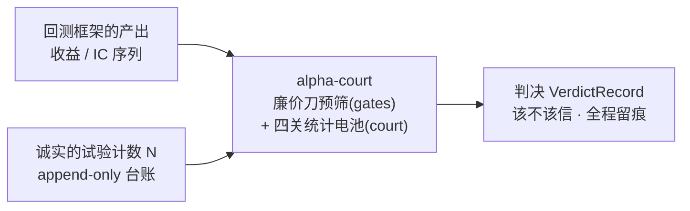
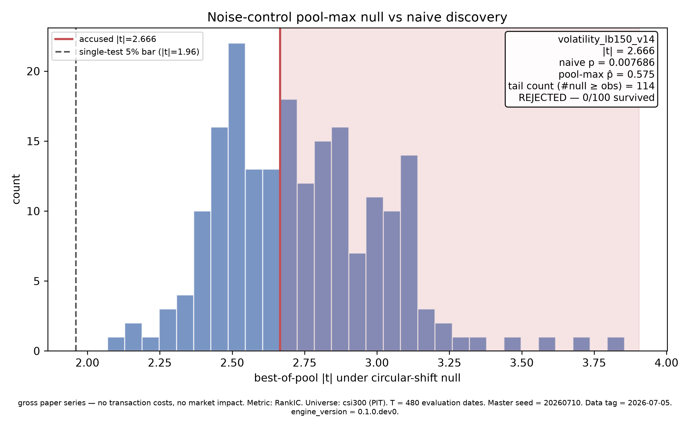
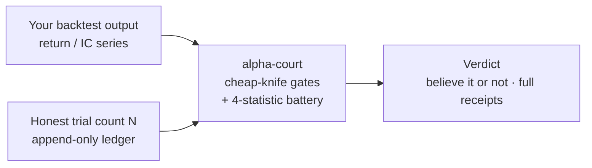

# alpha-court

> 回测框架告诉你 idea 表现多好，**alpha-court 告诉你该不该信**。
> Backtest frameworks tell you how well your idea did. **alpha-court tells you whether to believe it.**

[](LICENSE)
[](pyproject.toml)
[](tests/)
[](pyproject.toml)
[](court/)

[中文](#中文) · [English](#english)

---

## 中文

**alpha-court** 是量化研究的"验证法庭"：它不做回测——它吃进回测框架产出的收益 / IC
序列，用一套带选择效应校正的统计电池裁决"这个结果该不该信"：

- **Deflated Sharpe Ratio**（Bailey & López de Prado）
- **回测过拟合概率 PBO**（CSCV 框架，Bailey, Borwein, López de Prado & Zhu）
- **BHY 多重检验 FDR 控制**（Benjamini–Hochberg–Yekutieli）
- **经验噪声对照**（个体关 + 池最大关）



### 杀手 demo：100 个噪声因子，0 个幸存

100 个纯噪声因子 → 裸选择按 |t| 挑出"最强因子" `volatility_lb150_v14`
（|t| = 2.67，裸 p = 0.0077——单独看像真的）→ 法庭全部驳回 **0/100**。

最有教育意义的细节：被告过了自己的**个体**噪声关（p̂ = 0.015），却死在**池最大**关
（p̂ = 0.575——199 个纯噪声池里有 114 个的 best-of 比它还强）。单独看像真的，放回
"百里挑一"的语境立刻现形——这就是被校正的选择效应。



红线是被告（|t|=2.666，裸 p=0.0077，单独看远超 1.96 的单测门槛）；直方图是
"每个纯噪声池各自的最强 |t|"——被告不过是噪声冠军里的中位数。图内即判决与全部口径。

```bash
python -m examples.killer_demo   # 预注册主种子 20260710，干净 checkout 上确定性复现
```

完整判决书：`examples/killer_demo/out/report.md`（头版 / 停尸房表 / 标本解剖 / 校准附录）。

### 校准的另一半：功率扫描

杀手 demo 回答的是**特异性**（纯噪声全灭，不冤枉）；`examples/power_calibration/`
回答**灵敏度**（漏放多少）：向数据注入冻结网格上的已知强度信号，扫描整套电池
在每档强度下的检出率——法庭不但要杀得干净，还要知道自己的刀在多弱的真信号
面前会钝。设计规格见 `docs/design/power-calibration.md`。

### 架构

仓库里每个顶层目录都有明确职责（这个仓库同时是"研究过程全程留痕"的展品，
所以过程工件也在——它们不是杂物，是收据）：

| 目录 | 职责 |
|---|---|
| `court/` | 市场无关的验证内核（DSR / PBO-CSCV / BHY / 经验 null）。不 import 任何市场代码。 |
| `gates/` | 廉价刀预筛：在昂贵统计前先杀显而易见的坏因子（同一性退化 / 池冗余 / 幅度换手比 / 单年运气），阈值来自预注册校准、不硬编码。 |
| `adapters/` | 市场特异性全部关在这里（qlib-cn / CSI300 PIT adapter）。 |
| `harness/` | 研究过程之门：trial 计数对账、anti-pattern lint、CONFIRM 预算门、发布脱敏审计。 |
| `scripts/` | 过程强制脚本（契约冻结、外审门、收据绑定发布等）。 |
| `examples/killer_demo/` | 杀手 demo，单一入口确定性复跑，判决书与图随仓库携带。 |
| `docs/` | 使用指南 · 逐统计量文献笔记(`research/`) · 设计规格与编号裁定(`design/`) · 过程案例文(`case-study.md`) |
| `tests/` | 633 个测试：统计实现的手算锚点 + 过程门的绕过红测。 |
| `.scratch/` | 归档区：建造期的外审原件、任务工单与收据，按历史语境原样保留（遮盖披露见 PUBLISHING.md）。 |
| `.claude/` `.githooks/` | 建造这个仓库用的技能与提交门（pre-commit 跑门套件）——过程透明的一部分。 |
| `CONTEXT.md` | 术语表：trial / hypothesis / verdict / declared protocol 的统一语言。 |

测试套件：`pytest`（本快照 633 个测试）。统计实现逐条对应公开文献，文献笔记见
`docs/research/`。

**使用指南：[docs/使用指南.md](docs/使用指南.md)** —— 安装、杀手 demo 判决书
怎么读、把你自己的回测结果带上法庭的四段最小代码、完整台账流程、判决速查表。

### 文档地图

| 层 | 内容 |
|---|---|
| [使用指南](docs/使用指南.md) | 上手说明书（见上） |
| `docs/research/` | 逐统计量文献笔记（dsr / pbo-cscv / bhy / qlib-cn-data）——每个实现决定钉到论文公式 |
| `docs/design/` | 9 份设计规格与编号裁定（court-kernel-spec / trial-ledger / noise-control / killer-demo / power-calibration / prereg-gate …）——先有规格与裁定，后有代码 |
| [docs/case-study.md](docs/case-study.md) | 这个仓库怎么建成的：跨模型对抗审查、全程裁定 ledger 的过程案例文 |

### 来源与披露

本公开仓库是私有开发仓的**脱敏快照**（单向镜像），公开侧不含开发期 commit 历史；
涉及 commit 顺序 / 预注册先于结果的证据指向私有历史，可应要求完整出示。遮盖动作
全部可见（`[REDACTED-EMPLOYER]`）并在 [PUBLISHING.md](PUBLISHING.md) 逐项披露。
零私有策略、零前雇主产物；统计方法一律从公开文献重写并逐条引用。

---

## English

**alpha-court** is a validation court for quant research. It does not run backtests —
it consumes the return / IC series your backtest framework produces, and rules on
whether the result deserves belief, using a selection-effect-aware statistical battery:

- **Deflated Sharpe Ratio** (Bailey & López de Prado)
- **Probability of Backtest Overfitting (PBO)** via CSCV (Bailey, Borwein, López de Prado & Zhu)
- **BHY multiple-testing FDR control** (Benjamini–Hochberg–Yekutieli)
- **Empirical noise controls** (per-factor gate + pool-max gate)



### The killer demo: 100 noise factors, 0 survivors

100 pure-noise factors → naive |t|-max selection "discovers" `volatility_lb150_v14`
(|t| = 2.67, naive p = 0.0077 — convincing in isolation) → the court rejects **all 100/100**.

The instructive detail: the accused passes its own **individual** noise gate (p̂ = 0.015)
yet dies at the **pool-max** gate (p̂ = 0.575 — 114 of 199 pure-noise pools produce a
stronger best-pick). Alone it looks real; put back into its best-of-100 context it
dissolves. That is the selection effect, corrected.


The red line is the accused (|t| = 2.666, naive p = 0.0077 — far past the 1.96
single-test bar); the histogram is "each pure-noise pool's own strongest |t|".
The accused is merely a median noise champion. Verdict and full conventions are in the figure.

```bash
python -m examples.killer_demo   # pre-registered master seed 20260710; deterministic on a clean checkout
```

Full verdict: `examples/killer_demo/out/report.md` (headline / morgue table / specimen
autopsy / calibration appendix).

### The other half of calibration: the power sweep

The killer demo establishes **specificity** (pure noise: zero survivors, no
false convictions); `examples/power_calibration/` measures **sensitivity**
(how much real signal gets missed): inject signals of known strength on a
frozen grid and sweep the battery's detection rate at each level — a court
must not only kill cleanly, it must know how weak a true signal dulls its
knives. Spec: `docs/design/power-calibration.md`.

### Architecture

Every top-level directory has a stated responsibility (this repository doubles
as an exhibit of a fully-receipted research process — the process artifacts are
receipts, not clutter):

| Directory | Responsibility |
|---|---|
| `court/` | Market-agnostic validation kernel (DSR / PBO-CSCV / BHY / empirical null). Never imports market code. |
| `gates/` | Cheap-knife pre-screens killing obviously-bad factors before expensive statistics (identity degeneracy / pool redundancy / magnitude-vs-turnover / single-year luck); thresholds come from pre-registered calibration, never hard-coded. |
| `adapters/` | Market specifics quarantined here (qlib-cn / CSI300 PIT adapter). |
| `harness/` | Research-process gates: trial-count reconciliation, anti-pattern lint, CONFIRM-time budget gate, publish desensitization audit. |
| `scripts/` | Process-enforcement scripts (contract freeze, external-review gate, receipt-bound publishing…). |
| `examples/killer_demo/` | The killer demo, single-entry deterministic re-run; verdict report and figure ship with the repo. |
| `docs/` | Usage guide · per-statistic literature notes (`research/`) · design specs with numbered rulings (`design/`) · process case study (`case-study.md`, Chinese). |
| `tests/` | 633 tests: hand-worked anchors for every statistic + bypass red-tests for the process gates. |
| `.scratch/` | Archive zone: build-period external-review originals, task tickets and receipts, kept verbatim in historical context (redaction disclosure in PUBLISHING.md). |
| `.claude/` `.githooks/` | The skills and commit gates used to build this repo (pre-commit runs the gate suite) — part of the process transparency. |
| `CONTEXT.md` | Glossary: the shared language of trial / hypothesis / verdict / declared protocol. |

Test suite: `pytest` (633 tests in this snapshot). Every statistical implementation
cites its public-literature source; research notes in `docs/research/`.

**Usage guide: [docs/使用指南.md](docs/使用指南.md)** (Chinese) — installation, how
to read the killer-demo verdict, minimal recipes for bringing your own backtest
results to court, the full ledger workflow, and a verdict cheat-sheet.

### Documentation map

| Layer | Content |
|---|---|
| [Usage guide](docs/使用指南.md) | The hands-on manual (Chinese; see above) |
| `docs/research/` | Per-statistic literature notes (dsr / pbo-cscv / bhy / qlib-cn-data) — every implementation decision pinned to a paper equation |
| `docs/design/` | 9 design specs with numbered rulings (court-kernel-spec / trial-ledger / noise-control / killer-demo / power-calibration / prereg-gate …) — specs and rulings precede code |
| [docs/case-study.md](docs/case-study.md) | How this repo was built: cross-model adversarial review with a full adjudication ledger (Chinese) |

### Provenance & disclosure

This public repository is a **desensitized snapshot** (one-way mirror) of a private
development repository; the public side carries no development commit history. Evidence
that relies on commit ordering (pre-registration before results) references the private
history and can be shown in full on request. All redactions are visible
(`[REDACTED-EMPLOYER]`) and itemized in [PUBLISHING.md](PUBLISHING.md). Zero private
strategy, zero prior-employer artifacts; statistical methods re-implemented from public
literature with per-formula citations.

### License

MIT — see [LICENSE](LICENSE).
